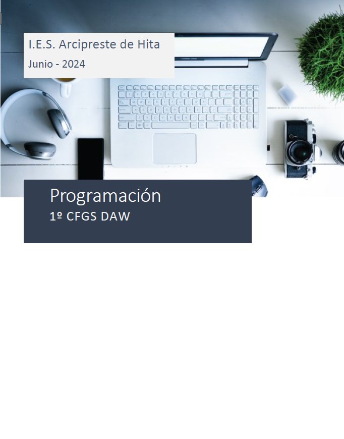

# DAW-Programacion
## Curso de Programación del 1º CFGS DAW.

### **IES Arcipreste de Hita**

### **César San Juan Pastor**

## Unidades de trabajo del curso
[UT_1 Introducción](https://htmlpreview.github.io/?https://github.com/csanjuanp-ies/DAW-Programacion/blob/main/ut_01/html/index.html)

[UT_2 Elementos de un programa informático](https://htmlpreview.github.io/?https://github.com/csanjuanp-ies/DAW-Programacion/blob/main/ut_02/html/index.html)

[UT_3 Estructuras de control](https://htmlpreview.github.io/?https://github.com/csanjuanp-ies/DAW-Programacion/blob/main/ut_03/html/index.html)

[UT_4 POO](https://htmlpreview.github.io/?https://github.com/csanjuanp-ies/DAW-Programacion/blob/main/ut_04/html/index.html)

[UT_5 POO bajo Python (I)](https://htmlpreview.github.io/?https://github.com/csanjuanp-ies/DAW-Programacion/blob/main/ut_05/html/index.html)

[UT_6 POO bajo Python (II) - Estructuras de datos](https://htmlpreview.github.io/?https://github.com/csanjuanp-ies/DAW-Programacion/blob/main/ut_06/html/index.html)

[UT_7 Proyecto](https://htmlpreview.github.io/?https://github.com/csanjuanp-ies/DAW-Programacion/blob/main/ut_07/html/index.html)

[UT_8 Gestión de datos](https://htmlpreview.github.io/?https://github.com/csanjuanp-ies/DAW-Programacion/blob/main/ut_08/html/index.html)

[UT_9 Interfaces gráficos](https://htmlpreview.github.io/?https://github.com/csanjuanp-ies/DAW-Programacion/blob/main/ut_09/html/index.html)

[Anexos](https://htmlpreview.github.io/?https://github.com/csanjuanp-ies/DAW-Programacion/blob/main/anexos/html/index.html)

[Licencia](https://htmlpreview.github.io/?https://github.com/csanjuanp-ies/DAW-Programacion/blob/main/LICENSE)

## Bibliografía
- Python 3 Los fundamentos del lenguaje (3a edición), Sébastien CHAZALLET, Ediciones ENI, ISBN 978-2-409-02478-8
- Curso de Programación Python (MANUALES IMPRESCINDIBLES), Arturo Montejo Ráez y Salud María Jiménez Zafra, 
Grupo Anaya Publicaciones Generales, ISBN 978-8441541160
- Learning Python, 5th Edition Fifth Edition, Mark Lutz, O’Relly, ISBN 978-1449355739
- Fluent Python: Clear, Concise, and Effective Programming 1st Edition, Luciano Ramalho, O’Relly, ISBN 978-1491946008
- Modern Python Cookbook - Second Edition, Steven F. Lott, O’Relly, ISBN 9781800207455
